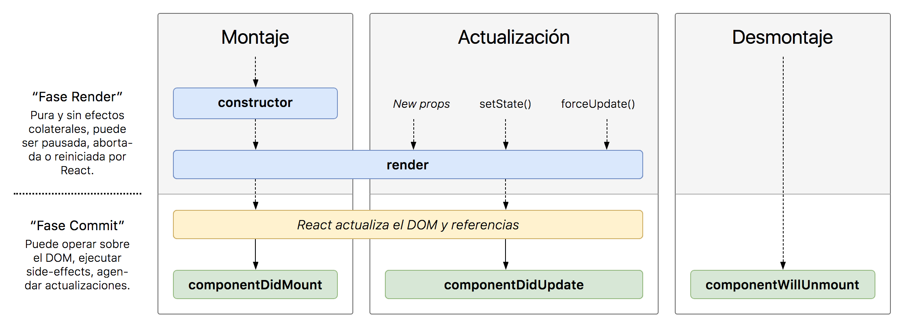

## Ciclo de vida de Componentes

Serie de estados por los cuales pasan los componentes statefull a lo largo de su existencia. Se pueden clasificar en tres etapas de montaje o inicialización, actualización y destrucción. Dichas etapas tienen correspondencia en diversos métodos.

### Tabla de Contenidos

1. [Montaje](#montaje)
    * [constructor](#montaje)
    * [render](#montaje)
    * [componentDidMount](#montaje)
1. [Actualizacion](#actualizacion)
    * [shouldComponentUpdate](#actualizacion)
    * [render](#actualizacion)
    * [componentDidUpdate](#actualizacion)
1. [Desmontaje](#desmontaje)
    * [componentWilUnmount](#desmontaje)

### Montaje
Es la primera fase del ciclo de vida, en la que se crea el componente. Sabemos que un componente de React representa un elemento del DOM y lo que contiene. En el momento en que ese elemento se pinta en el DOM, aparece visualmente en la página web, decimos que ese componente está montado.

| Metodo | Descripcion |
|--|--|
| __constructor()__ | Se ejecuta cuando se crea el componente por código y se le pasan las props iniciales. Aquí inicializamos el estado enlazamos los event handlers a la instancia con _.bind(this)_|
| __render()__ | Es el encargado de montar el componente, devuelve lo que se pinta en función de props y state|
| __componentDidMount()__ | Es llamado una vez que el componente es "montado". Es comúnmente usado para provocar la carga de datos desde una fuente remota a través de una API|

### Actualización

Mientras un componente está montado, si cambian las props o el estado, el componente se vuelve a renderizar. Esto ocurre siempre por defecto. Sin embargo, con los métodos del ciclo de vida podemos adaptar esto a nuestras necesidades: podremos hacer operaciones en distintos puntos de la actualización o hasta impedir que el componente se re-renderice si se dan unas condiciones, ya que estos métodos son paralelos al montaje del componente.

| Metodo | Descripcion |
|--|--|
| __shouldComponentUpdate()__ | Permite al desarrollador prevenir el re-renderizado innecesario de un componente, devolviendo falso si no es necesario|
| __render()__ | Este metodo monta nuevamente el componente actualizado|
| __componentDidUpdate (prevProps, prevState)__ | Se llama justo después de re-renderizar un componente por actualización de sus props o estado. Si el componente hace peticiones que dependen de una prop, este es buen lugar para rehacerlas, después de comprobar que efectivamente esa prop en concreto ha cambiado|

### Desmontaje

Si el montaje es la primera fase del ciclo de vida de un componente, el desmontaje es la última fase del ciclo de vida del componente. Es la parte en la que se va a destruir el componente y va a dejar de mostrarse en pantalla y de existir en memoria.

| Metodo | Descripcion |
|--|--|
| __componentWillUnmount()__ | Es comúnmente usado para limpiar la demanda de dependencias del componente que no será simplemente removido con el desmontaje del componente|

render es el método más importante de los ciclos de vida y el único requerido en cualquier componente. Es usualmente llamado cada vez que el estado del componente es actualizado, reflejando los cambios en la interfaz de usuario.

[volver a pagina principal](../readme.md)